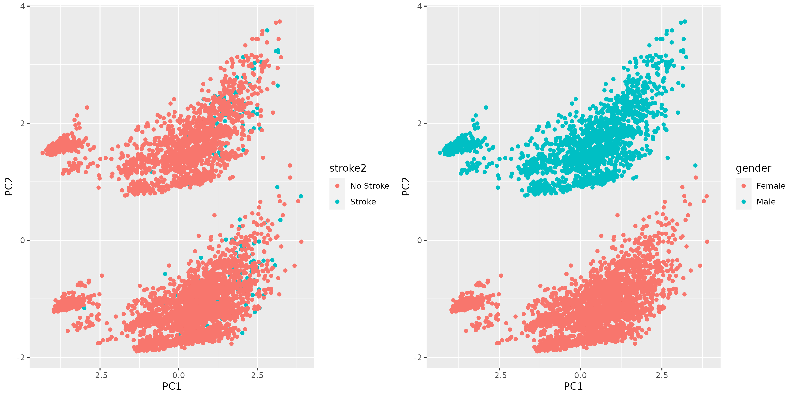

```{r setup, include=FALSE}
knitr::opts_chunk$set(echo = TRUE)
```


```{r}
library(ggplot2)
library(dplyr)
library(pROC)
setwd("/home/rstudio/work")
```

# Introduction: 
This analysis uses Stroke data and aims to find risk factors for stroke. Data used is from https://www.kaggle.com/datasets/fedesoriano/stroke-prediction-dataset, which contains 5110 observations and 12 variabbles. Stroke is treated as binary outcome and use logistic regression and model selection to fit he data. At the end, model diagnosis was used to evaluate the model fit.

# Data preprocessing: 
Missing value was checked. Only BMI had missing value and the number of missing was less than 5%. Therefore,removed all observations with missing value. Then, variable type in the dataframe was checked and transformed for better fit for making table1 and fitting model.

# Result

## Descriptive analysis

After filtering, there were 4908 observations in this analysis. 59% percent of the participants were female and the mean age was 43.

```{r}
table1<-readRDS("data_for_report/table1.rds")
table1
```

209 participants had the Stoke and 4699 participants didn't have the Stroke (barplot). Then PCA was used to get features of predictors. The two clusters in the PCA plot were caused by gender.

```{r}
knitr::include_graphics("figures/Barplot.png")


```

## logistic regression model

Stepwsie method was apply to do the model selection. Best model included "age", "hypertension", "heart diesease", "average glucose level".
In summary, increaing age, having hypertension, having heart disease, having higher blood glucose are risk factors for stroke.

```{r}
m_f<-readRDS("data_for_report/model.rds")
summary(m_f)
```

## model diagnosis

All samples had Cook's distance less than 1. No influential points.

```{r}
load("data_for_report/sensitivity.rds")
plot(cooks.distance, main = "Cook's Distance")
```

Sensitivity for thsi model was 0.113 and specificity for this model was 0.990. 

```{r}
print(paste("sensitivity=",sensitivity))
print(paste("specificity=",specificity))
```

The model AUC was 0.85

```{r}
plot(roc_curve, main = "ROC Curve", col = "blue")
auc_value <- auc(roc_curve)
print(paste("AUC:", auc_value))
```

# conclusion

To conclude, increaing age, having hypertension, having heart disease, having higher blood glucose are risk factors for stroke.
